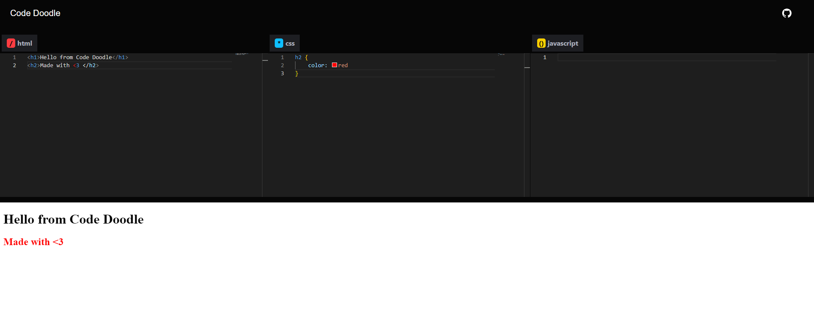

# Code Doodle - Playground for devs

This website lets you hone your skills of HTML, CSS & JS with an integrated code editor. You can see your code taking shape with an integrated iFrame web frame.
Live Link - https://code-doodle.vercel.app/

## Technologies Used
### React.js: 
### Monaco-code editor
### iFrame

## Features

## 🚀 About Me
I'm a full stack developer currently working in Cisco.

## 🔗 Links

## 🛠 Skills
HTML, CSS, JS, ReactJS, Next.JS, TailwindCSS, Python Django, Flask, AWS, GCP.